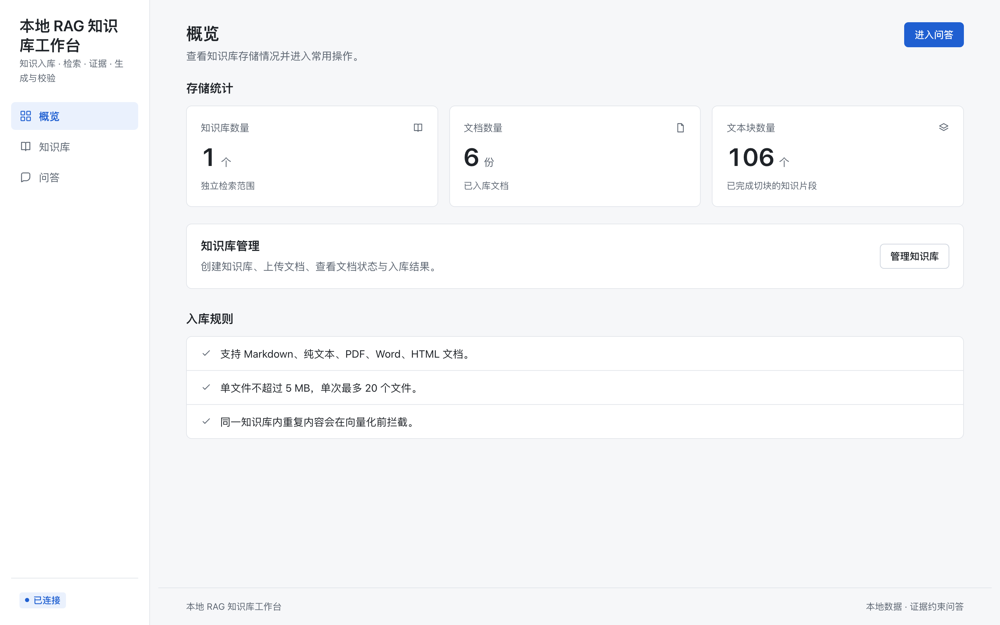
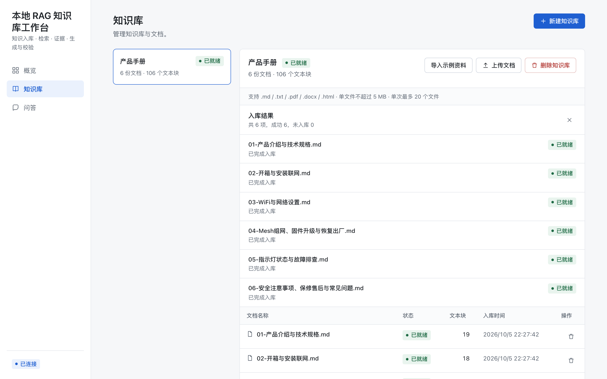
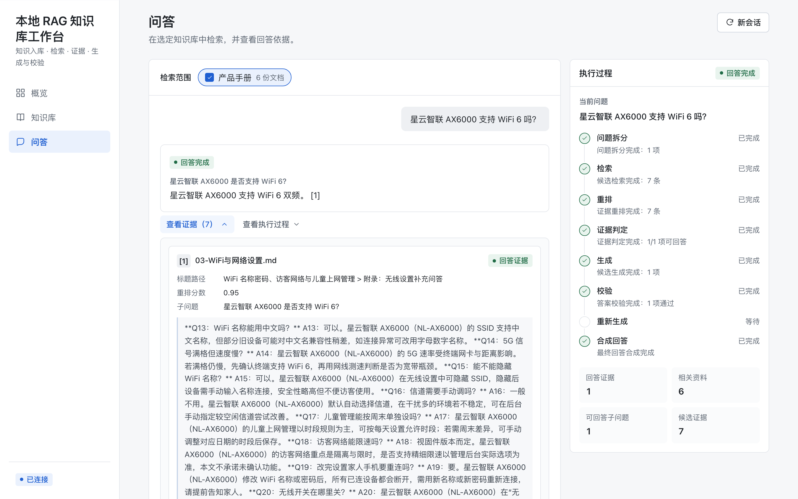
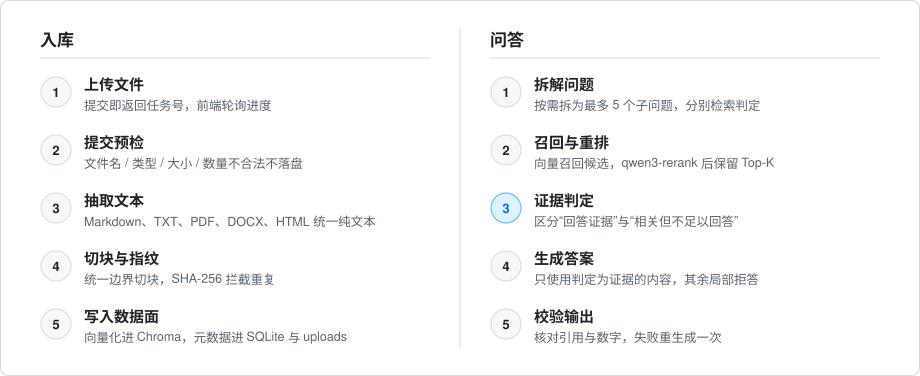

<h1 align="center">Evidence-RAG</h1>

<p align="center"><strong>本地存资料，在线用模型，回答必须先过证据这一关。</strong></p>

<p align="center">
  把 Markdown / TXT / PDF / Word / HTML 放进本地知识库，系统完成切块、向量检索、重排与证据判定后，只回答资料能支撑的部分。
</p>

<p align="center">
  <a href="https://www.python.org/"></a>
  <a href="https://fastapi.tiangolo.com/"></a>
  <a href="https://react.dev/"></a>
  <a href="https://www.typescriptlang.org/"></a>
  <a href="https://www.trychroma.com/"></a>
  <a href="https://help.aliyun.com/zh/model-studio/compatibility-of-openai-with-dashscope"></a>
</p>

---

## 它解决什么问题

普通 RAG 容易把“检索到相关内容”直接当成“可以回答”。Evidence-RAG 在检索之后增加一道**证据判定**，把结论分成三类：

- **可以回答**：证据能直接支撑，生成后再校验引用与数字；
- **部分可以**：复合问题按子问题拆开，有证据的回答，没证据的明确拒答；
- **不能回答**：资料只是相关、但不足以作答时，宁可拒答，也不编造。

> 数据（SQLite、原始文件、向量索引）全部保存在本机；模型调用走在线 OpenAI 兼容接口。这是一个本地单用户 MVP，不按生产级 SaaS 设计。

<p align="center">
  
</p>

<p align="center"><sub>概览：运行配置与本地存储统计</sub></p>

<p align="center">
  
</p>

<p align="center"><sub>知识库管理：多格式文档异步上传与逐文件进度</sub></p>

<p align="center">
  
</p>

<p align="center"><sub>证据问答：回答引用、执行过程与原文证据同屏核对</sub></p>

## 核心能力

**入库**

- Markdown、TXT、PDF、DOCX、HTML 统一抽取为纯文本，走同一条切块与向量化链路
- 异步上传：提交即返回任务号，前端轮询逐文件进度，可取消、可重新提交失败文件
- 提交前校验文件名 / 扩展名 / 大小 / 数量，非法请求不写盘、不创建任务
- 基于规范化内容的 SHA-256 摘要，重复文档在向量化前拦截

**问答**

- 问题按需拆成最多 5 个子问题，分别检索、分别判定
- SQLite FTS5 关键词召回 + Chroma 向量召回，RRF 融合后经 `qwen3-rerank` 重排
- 证据分级：回答证据 / 相关但不足以回答
- 生成后校验引用、数字与证据边界；失败部分携带原因重生成一次
- SSE 实时返回拆解、检索、判定、生成、校验每个阶段的状态

**运维**

- `doctor` 数据面体检、`rebuild` 向量重建、`backup` / `restore` 一键快照回滚
- 固定 14 条评测集与 online 基线（含 MRR / 引用准确率 / 忠实度）；94 个自动化测试不访问网络
- Provider 指数退避重试；启动时安全清理残留任务文件

## 工作原理

<picture>
  <source media="(prefers-color-scheme: dark)" srcset="docs/diagram/numbered-steps-dark.svg" />
  
</picture>

## 技术栈

| 层 | 选型 |
| --- | --- |
| Web | React 19 · TypeScript · Vite · Tailwind CSS |
| API | FastAPI · SSE |
| 工作流 | 自研 `evidence_qa` 编排，不依赖 LangChain / LangGraph |
| 检索 | Chroma · Qwen Embedding · qwen3-rerank |
| 数据 | SQLite · 本地文件 · spool 任务目录 |

## 快速开始

环境要求：macOS / Linux、Python `3.12`、Node.js 与 `pnpm`、可用的阿里云百炼 API Key。

```bash
git clone https://github.com/qihanqiu980-gif/Evidence-RAG.git
cd Evidence-RAG
python3.12 -m venv .venv
.venv/bin/pip install -e '.[dev]'
cp .env.example .env        # 填入 RAG_APP_API_KEY
cd frontend && pnpm install && pnpm run build && cd ..
.venv/bin/rag-app serve     # 打开 http://127.0.0.1:8010
```

首次使用：新建知识库 → “导入示例资料”（6 份 Markdown）→ 到“问答”页提问，并在右侧核对证据。

> [!CAUTION]
> API Key 只能保存在已被 Git 忽略的 `.env` 中，不要写入源码、测试、日志或提交记录。

## 配置

| 变量 | 默认值 | 说明 |
| --- | --- | --- |
| `RAG_APP_API_KEY` | 无 | 必填，Chat / Embedding / Rerank 共用 |
| `RAG_APP_BASE_URL` | DashScope 兼容地址 | OpenAI 兼容接口 |
| `RAG_APP_CHAT_MODEL` | `qwen3.7-plus` | 改写、拆解与回答生成 |
| `RAG_APP_EMBEDDING_MODEL` | `text-embedding-v4` | 向量化模型（维度 `1024`） |
| `RAG_APP_RERANK_MODEL` | `qwen3-rerank` | 重排模型 |
| `RAG_APP_DATA_DIR` | `data` | SQLite / uploads / Chroma / spool 根目录 |
| `RAG_APP_CHUNK_SIZE` / `CHUNK_OVERLAP` | `800` / `100` | 切块大小与重叠 |
| `RAG_APP_RETRIEVAL_TOP_K` | `7` | 每个子问题重排后保留的候选数 |
| `RAG_APP_HYBRID_RETRIEVAL` | `true` | 关键词 + 向量混合检索开关 |
| `RAG_APP_RETRIEVAL_VECTOR_WEIGHT` / `KEYWORD_WEIGHT` / `RRF_K` | `1.0` / `1.0` / `60` | RRF 融合权重与平滑常数 |

上传限额、并发、重试、日志、评测成本单价等完整变量见 [`.env.example`](.env.example)。

> [!WARNING]
> 更换 Embedding 模型、向量维度或切块边界后，旧向量不能复用：先 `backup`，再 `rebuild` 并重新入库，最后重跑评测基线。

## 验证与运维

```bash
.venv/bin/pytest && .venv/bin/ruff check src tests && .venv/bin/mypy src tests
cd frontend && pnpm run build && pnpm run test:e2e
.venv/bin/rag-app doctor
```

常用 CLI：`rag-app serve | doctor | rebuild | eval | backup | restore`

评测：`.venv/bin/rag-app eval --dataset eval/cases.jsonl --top-k 7`。当前 online 基线 **14/14 通过**，检索命中率与拒答预期通过率均为 **100%**，并输出 MRR、引用准确率与忠实度，记录见 [`eval/baselines/`](eval/baselines/)。

## 边界与计划

当前限制：本地单用户无鉴权；任务状态在内存中、服务重启后不保证可查；会话历史只在当前页面；失败文件重提依赖浏览器内存中的 `File` 对象；模型能力依赖外部接口与网络。

后续计划：会话持久化、API 鉴权与限流；扩展 chunk 级相关性标注与分领域评测集；如需跨重启任务状态，再评估专用持久化方案。

## 更多文档

- 产品需求：[docs/PRD.md](docs/PRD.md)
- 技术设计：[docs/TECHNICAL_DESIGN.md](docs/TECHNICAL_DESIGN.md)
- UI 设计：[docs/UI设计文档.md](docs/UI设计文档.md)

---

<p align="center">重点不是让模型“尽量回答”，而是让每个回答尊重知识库的证据边界。</p>
