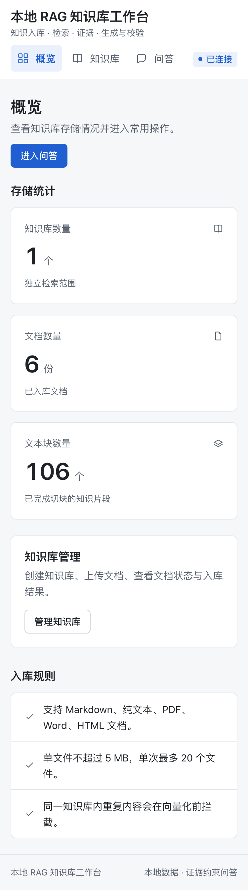
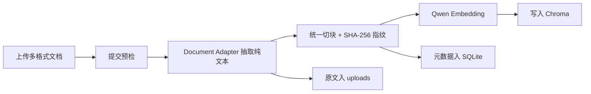
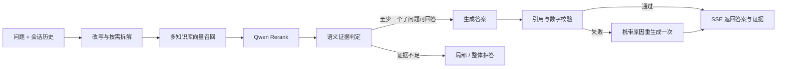
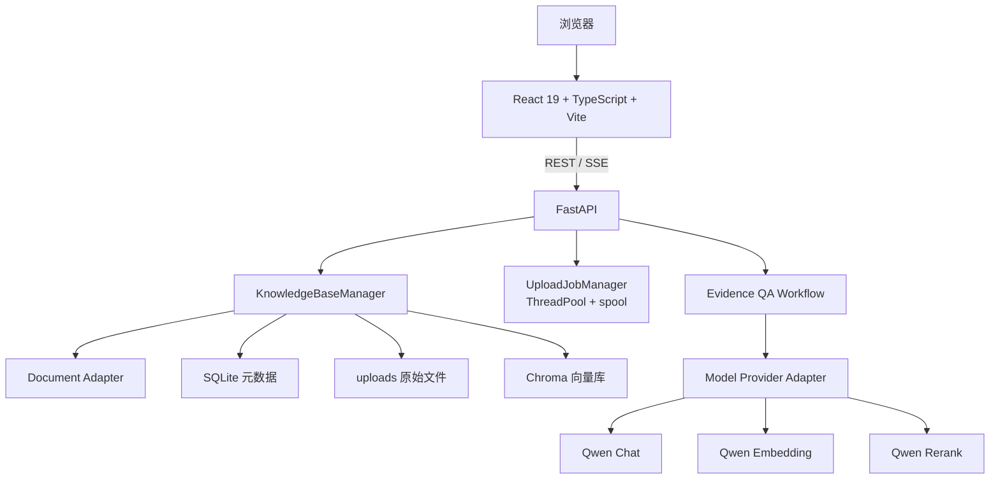

<h1 align="center">Evidence-RAG</h1>

<p align="center"><strong>本地资料、在线模型，证据先行的知识库工作台。</strong></p>

<p align="center">
  把 Markdown、纯文本、PDF、Word、HTML 资料放进本地知识库：先检索、再重排、后判定，只有证据充分的内容才会进入回答，并对引用和数字做生成后校验。
</p>

<p align="center">
  <a href="https://www.python.org/"></a>
  <a href="https://fastapi.tiangolo.com/"></a>
  <a href="https://react.dev/"></a>
  <a href="https://www.typescriptlang.org/"></a>
  <a href="https://www.trychroma.com/"></a>
  <a href="https://help.aliyun.com/zh/model-studio/compatibility-of-openai-with-dashscope"></a>
</p>

<p align="center">
  <a href="#overview">项目简介</a> ·
  <a href="#features">核心能力</a> ·
  <a href="#workflow">工作流程</a> ·
  <a href="#design">核心设计</a> ·
  <a href="#architecture">系统架构</a> ·
  <a href="#quick-start">快速开始</a> ·
  <a href="#configuration">配置说明</a> ·
  <a href="#cli">CLI 与评测</a>
</p>

---

<a id="overview"></a>

## 项目简介

Evidence-RAG（代码包名 `rag-app`）是一个本地数据、在线模型的通用 RAG 知识库工作台。文档解析、切块、元数据和向量索引全部保存在本机；Chat、Embedding 与 Rerank 通过 OpenAI 兼容接口调用在线模型。回答链路固定执行问题拆分、检索、重排、语义证据判定、生成和校验，并通过 SSE 逐阶段返回执行状态。

这个项目关注的不只是“找到相关内容”，而是进一步判断：**现有资料是否足以直接回答问题**。

```text
检索命中 ≠ 证据充分
生成完成 ≠ 校验通过
证据不足 → 局部拒答
```

> [!NOTE]
> 本项目是本地单用户 MVP，面向个人知识管理场景，不按生产级 SaaS 系统设计。

<p align="center">
  
</p>

<p align="center"><sub>工作台概览：运行配置与本地存储统计</sub></p>

<p align="center">
  
</p>

<p align="center"><sub>知识库管理：多格式文档异步上传与逐文件进度</sub></p>

<p align="center">
  
</p>

<p align="center"><sub>证据问答：回答引用、执行过程与原文证据同屏核对</sub></p>

<p align="center">
  
</p>

<p align="center"><sub>移动端布局</sub></p>

<a id="features"></a>

## 核心能力

| 能力 | 当前实现 |
| --- | --- |
| 知识库管理 | 多知识库创建、查看、删除，问答时可同时选择多个知识库 |
| 多格式入库 | Markdown、`.txt`、PDF、Word `.docx`、HTML（`.html` / `.htm`）统一抽取为纯文本后走同一链路 |
| 异步上传 | 提交立即返回 `job_id`，前端轮询逐文件进度；支持取消任务和失败文件重新提交 |
| 提交预检 | 文件名、扩展名、大小、数量在创建任务前快速校验，非法请求不写 spool、不落盘 |
| 重复拦截 | 基于规范化内容的 SHA-256 摘要，在向量化前拦截重复文档 |
| 问题拆解 | 结合会话历史改写问题，按需拆为最多 5 个可独立回答的子问题 |
| 检索与重排 | Chroma 向量召回候选，`qwen3-rerank` 重排后保留 Top-K |
| 证据判定 | 将“相关资料”与“足以直接回答的证据”分开判断 |
| 局部拒答 | 复合问题中有证据的部分正常回答，证据不足的部分单独拒答 |
| 生成后校验 | 检查引用合法性、数字支持与证据边界；失败部分携带原因重新生成一次 |
| 可追溯展示 | 文档名、标题路径、原文片段、向量分数与重排分数随答案展示 |
| 流式反馈 | 通过 SSE 返回改写、检索、判定、生成、校验阶段的实时状态 |
| 运维工具 | `doctor` 数据面检查、`rebuild` 向量重建、`backup` / `restore` 快照、`eval` 固定评测 |
| 运行稳定性 | 启动前 doctor、安全日志初始化、Provider 指数退避重试、退出时幂等释放客户端 |

<a id="workflow"></a>

## RAG 工作流程

### 文档入库



### 用户问答



问答工作流在 `workflow registry` 中注册为 `evidence_qa`，内部固定执行 `decompose → retrieval → rerank → judge → answer / refuse → verify`。

<a id="design"></a>

## 核心设计

### 1. 本地数据、在线模型

SQLite、uploads 与 Chroma 组成本地数据面，全部落在 `RAG_APP_DATA_DIR`；模型能力通过轻量 Provider Adapter 调用 OpenAI 兼容的 Chat、Embedding 和 Rerank 接口，不引入 LangChain / LangGraph。自动化测试注入 Fake Provider 和临时数据目录，不访问网络、不读取 `.env`。

### 2. 把“相关”与“可回答”分开

向量相似或重排靠前只说明资料与问题相关，不能证明它包含直接答案。系统在检索后增加语义证据判定，把候选资料标记为**回答证据**或**相关但不足以直接回答**，并按子问题分别判断，因此可以回答有依据的部分、拒绝没有依据的部分。

### 3. 生成不是终点

初次生成后，系统继续检查引用是否合法、数字是否受到证据支持、回答是否越过已判定的证据边界。校验失败的部分会携带失败原因重新生成一次；再次失败则不作为已验证答案输出（fail-closed）。

### 4. 数据面可备份、索引可重建

SQLite 和 uploads 是业务事实，Chroma 是可重建的派生索引。`rag-app backup` 把三者与 manifest 一起打包为 `.tar.gz` 快照，`restore` 可整体回滚；修改切块或 Embedding 配置前先做备份，再用 `rebuild` 重建向量。

### 5. 异步任务的显式取舍

上传使用进程内线程池 + spool 目录，不引入 Redis / Celery。任务状态保存在内存中，服务重启后不保证可查；启动时安全清理遗留 spool。取消采用协作式语义：排队任务直接取消，运行中任务在文件或阶段边界停止，已完成项的结果保留。

<a id="architecture"></a>

## 系统架构



| 层级 | 技术 | 职责 |
| --- | --- | --- |
| Web | React 19、TypeScript、Vite、Tailwind CSS | 知识库管理、上传任务、问答交互与证据展示 |
| API | FastAPI、SSE | 文档接口、异步任务、流式问答与静态前端托管 |
| 工作流 | 自研 `evidence_qa` 编排 | 拆解、检索、判定、回答、校验与局部拒答 |
| 检索 | Chroma、Qwen Embedding、qwen3-rerank | 候选召回与重排 |
| 数据 | SQLite、本地文件、spool | 元数据、原始文档与向量索引持久化 |
| Provider | OpenAI 兼容接口 | Chat、Embedding、Rerank 的统一适配与重试 |

<a id="quick-start"></a>

## 快速开始

### 环境要求

- macOS / Linux
- Python `3.12`
- Node.js 与 `pnpm`
- 可用的阿里云百炼 API Key，并已开通所配置的模型

### 1. 克隆项目

```bash
git clone https://github.com/qihanqiu980-gif/Evidence-RAG.git
cd Evidence-RAG
```

### 2. 安装后端依赖

```bash
python3.12 -m venv .venv
.venv/bin/pip install -e '.[dev]'
```

### 3. 安装并构建前端

```bash
cd frontend
pnpm install
pnpm run build
cd ..
```

### 4. 配置环境变量

```bash
cp .env.example .env
```

打开 `.env`，至少填写：

```dotenv
RAG_APP_API_KEY=your-api-key
```

> [!CAUTION]
> API Key 只能保存在已被 Git 忽略的 `.env` 中。不要把密钥写入 `.env.example`、源码、测试、日志或提交记录。

### 5. 启动服务

```bash
.venv/bin/rag-app serve
```

浏览器访问 [http://127.0.0.1:8010](http://127.0.0.1:8010)。服务启动时会初始化安全日志，并对已有数据目录执行启动前 doctor：错误阻断启动，警告继续启动。

### 首次使用

1. 创建一个知识库；
2. 点击“导入示例资料”一键导入 6 份 Markdown，或上传 PDF / Word / HTML / TXT 文档；
3. 等待逐文件进度变为“已完成”；
4. 在“问答”页面选择知识库并提问；
5. 在右侧核对回答引用与原始证据，注意区分“回答证据”和“相关资料”。

<a id="configuration"></a>

## 配置说明

| 变量 | `.env.example` 中的值 | 说明 |
| --- | --- | --- |
| `RAG_APP_API_KEY` | 无 | 必填，Chat、Embedding 与 Rerank 共用 |
| `RAG_APP_BASE_URL` | `https://dashscope.aliyuncs.com/compatible-mode/v1` | OpenAI 兼容接口地址 |
| `RAG_APP_CHAT_MODEL` | `qwen3.7-plus` | 问题改写、拆解与回答生成 |
| `RAG_APP_EMBEDDING_MODEL` | `text-embedding-v4` | 文本向量化模型 |
| `RAG_APP_EMBEDDING_DIMENSION` | `1024` | Embedding 实际返回的向量维度 |
| `RAG_APP_RERANK_MODEL` | `qwen3-rerank` | 重排模型 |
| `RAG_APP_RERANK_URL` | `https://maas.qianwenaiapi.com/compatible-api/v1/reranks` | Rerank 接口地址 |
| `RAG_APP_DATA_DIR` | `data` | SQLite、uploads、Chroma 与 spool 的根目录 |
| `RAG_APP_UPLOAD_MAX_BYTES` | `5242880` | 单文件大小上限（5 MB） |
| `RAG_APP_UPLOAD_MAX_FILES` | `20` | 单次上传数量上限 |
| `RAG_APP_UPLOAD_MAX_WORKERS` | `2` | 入库线程池并发数 |
| `RAG_APP_CHUNK_SIZE` | `800` | 文本块大小 |
| `RAG_APP_CHUNK_OVERLAP` | `100` | 相邻文本块重叠长度 |
| `RAG_APP_RETRIEVAL_TOP_K` | `7` | 每个子问题重排后保留的候选数 |
| `RAG_APP_CANDIDATE_MULTIPLIER` | `20` | 向量召回的候选扩展倍数 |
| `RAG_APP_MAX_SUBQUESTIONS` | `5` | 复合问题拆分子问题上限 |
| `RAG_APP_MAX_RETRIES` | `1` | Provider 连接错误 / HTTP 5xx 重试次数 |
| `RAG_APP_RETRY_BACKOFF_SECONDS` | `0.2` | 重试指数退避基数 |
| `RAG_APP_COST_*_PRICE_PER_1K` | 空 | 可选评测成本单价；缺失时 `estimated_cost` 为 `null`，不生成伪估算 |

> [!WARNING]
> 更换 Embedding 模型、向量维度或切块边界后，已有向量不能继续复用。请先 `rag-app backup` 保留数据，再重建索引并重新上传文档；改动后建议重跑 14 条 online 评测基线。

<a id="cli"></a>

## CLI 与评测

| 命令 | 作用 |
| --- | --- |
| `rag-app serve` | 启动本地工作台（默认 `127.0.0.1:8010`，同端口托管前端构建产物） |
| `rag-app doctor` | 检查 SQLite、uploads 与 Chroma 数据面一致性 |
| `rag-app rebuild` | 从 SQLite 中的切块重建 Chroma 向量索引 |
| `rag-app eval` | 在 online Provider 上运行固定评测集 |
| `rag-app backup [目录]` | 把 SQLite、uploads、Chroma 与 manifest 打包为 `.tar.gz` 快照 |
| `rag-app restore <归档> --yes` | 从快照恢复整个数据面 |

### 运行验证

```bash
.venv/bin/pytest
.venv/bin/ruff check src tests
.venv/bin/mypy src tests

cd frontend
pnpm run build
pnpm run test:e2e
```

E2E 会临时启动 8011 端口的 FastAPI 测试实例，注入 Fake Provider 和独立数据目录，不访问网络、不污染 `data/`。

### 固定评测

```bash
.venv/bin/rag-app doctor
.venv/bin/rag-app eval --dataset eval/cases.jsonl --top-k 7
```

评测集包含 14 条用例，覆盖规格、安装、WiFi、Mesh、恢复出厂、故障排查、保修、知识库外问题、复合问题、局部证据不足与多轮追问。输出包括逐 case 与汇总延迟、p50 / p95、token usage、Provider 重试与失败统计。

当前 Markdown online 基线见 [`eval/baselines/2026-10-05-online.md`](eval/baselines/2026-10-05-online.md)：**14/14 通过，检索命中率 100%，拒答预期通过率 100%**。M8 / M9 验证记录见 [`eval/baselines/`](eval/baselines/)，最新快照为 89 个自动化测试全部通过。

<a id="structure"></a>

## 项目结构

```text
Evidence-RAG/
├── frontend/                     # React 19 工作台
│   └── src/
│       ├── App.tsx               # 页面、知识库与上传任务
│       ├── Chat.tsx              # 问答与证据展示
│       ├── api.ts                # REST / SSE 客户端
│       └── types.ts              # 前端类型
├── src/rag_app/
│   ├── api/                      # FastAPI 应用、契约与 SSE
│   ├── core/                     # Adapter、入库、检索、工作流、异步任务
│   ├── providers/                # Chat / Embedding / Rerank 适配
│   ├── storage/                  # SQLite / Chroma / uploads / backup
│   ├── evaluation.py             # 固定评测
│   ├── config.py                 # 配置加载
│   ├── logging.py                # 安全日志
│   ├── models.py                 # 领域模型
│   ├── errors.py                 # 业务错误契约
│   ├── server.py                 # 生产应用入口
│   └── cli.py                    # CLI 命令
├── tests/                        # 89 个自动化测试（Fake Provider）
├── eval/                         # 固定评测集与 online 基线
├── assets/demo-docs/             # 6 份示例 Markdown
├── docs/                         # PRD / 技术设计 / UI 设计 / 截图
└── .env.example                  # 环境变量示例
```

<a id="limitations"></a>

## 已知限制与后续计划

### 当前限制

- 本地单用户工作台，没有账号、权限和租户隔离；
- 任务状态只保存在进程内存中，服务重启后 `GET /api/jobs/{id}` 不保证可查；
- 会话历史只保留在当前浏览器页面中；
- 失败文件“重新提交”依赖页面内存中的 `File` 对象，刷新后需要重新选择；
- Chat、Embedding 与 Rerank 依赖外部千问接口和当前网络环境。

### 后续计划

- 检索质量增强：关键词 + 向量混合检索，补充 MRR、引用准确率与忠实度指标；
- 产品化演进：场景路由、会话持久化、API 鉴权与限流；
- 如未来需要跨重启的任务状态，再评估专用持久化方案，不临时引入 Redis / Celery。

## 文档

- 产品需求：[docs/PRD.md](docs/PRD.md)
- 技术设计：[docs/TECHNICAL_DESIGN.md](docs/TECHNICAL_DESIGN.md)
- UI 设计：[docs/UI设计文档.md](docs/UI设计文档.md)
- 评测基线：[eval/baselines/](eval/baselines/)

---

<p align="center">
  本地数据、在线模型、证据先行的通用 RAG 工作台。<br />
  重点不是让模型“尽量回答”，而是让每个回答尊重知识库的证据边界。
</p>
